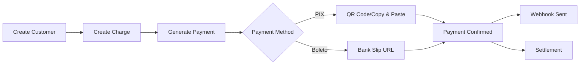

## Welcome to Debita AI

Debita AI is a modern, developer-first payment platform designed specifically for the Brazilian market. Our unified API makes it simple to accept payments, manage customers, and scale your business across Brazil.

<CardGroup cols={2}>
  <Card
    title="Quick Start"
    icon="play"
    href="/quickstart"
  >
    Get up and running with Debita AI in under 5 minutes
  </Card>
  <Card
    title="API Reference"
    icon="code"
    href="/api-reference"
  >
    Detailed documentation for all API endpoints
  </Card>
  <Card
    title="Payment Methods"
    icon="credit-card"
    href="/payment-methods"
  >
    Support for PIX, Boleto and Payment Links
  </Card>
  <Card
    title="Webhooks"
    icon="webhook"
    href="/webhooks"
  >
    Real-time notifications for payment events
  </Card>
</CardGroup>

## Key Features

<AccordionGroup>
  <Accordion title="Unified API" icon="link">
    One API that automatically adapts to your environment. Use `pk_test_` keys for development and `pk_live_` keys for production - no configuration changes needed.
  </Accordion>

  <Accordion title="Brazilian Payment Methods" icon="flag">
    Complete support for PIX (instant payments) and Boleto (bank slips) with full Brazilian banking regulations compliance and instant settlement.
  </Accordion>

  <Accordion title="Real-time Webhooks" icon="bell">
    Get notified instantly when payments are confirmed, failed, or refunded. Built-in retry logic ensures you never miss an event.
  </Accordion>

  <Accordion title="Advanced Security" icon="shield">
    Enterprise-grade security with fraud detection, risk scoring, and full compliance with Brazilian financial regulations (LGPD, BACEN).
  </Accordion>

  <Accordion title="Dashboard & Analytics" icon="chart-line">
    Comprehensive dashboard with real-time metrics, transaction history, and detailed analytics to track your business performance.
  </Accordion>

  <Accordion title="Developer Experience" icon="code">
    RESTful API, comprehensive SDKs, detailed documentation, and sandbox environment for testing. Built by developers, for developers.
  </Accordion>
</AccordionGroup>

## Payment Flow Overview

## Settlement Times

<CardGroup cols={3}>
  <Card title="PIX" icon="zap">
    **D+0** - Instant settlement, 24/7/365
  </Card>
  <Card title="Boleto" icon="calendar">
    **D+1** - 1 business day after payment
  </Card>
</CardGroup>

## Supported Regions

Debita AI is specifically designed for the Brazilian market and supports:

- **All Brazilian banks** and payment service providers
- **CPF and CNPJ validation** for individual and business customers
- **CEP-based address validation** for accurate delivery
- **Brazilian phone number formats** with area code validation
- **LGPD compliance** for data protection and privacy

## Getting Started

Ready to start accepting payments? Follow our quickstart guide:

<Card
  title="Start Building"
  icon="rocket"
  href="/quickstart"
>
  Complete your first integration in under 10 minutes
</Card>

Need help? Contact our support team at **support@debita.ai** or check our [community Discord](https://debita.ai/discord).