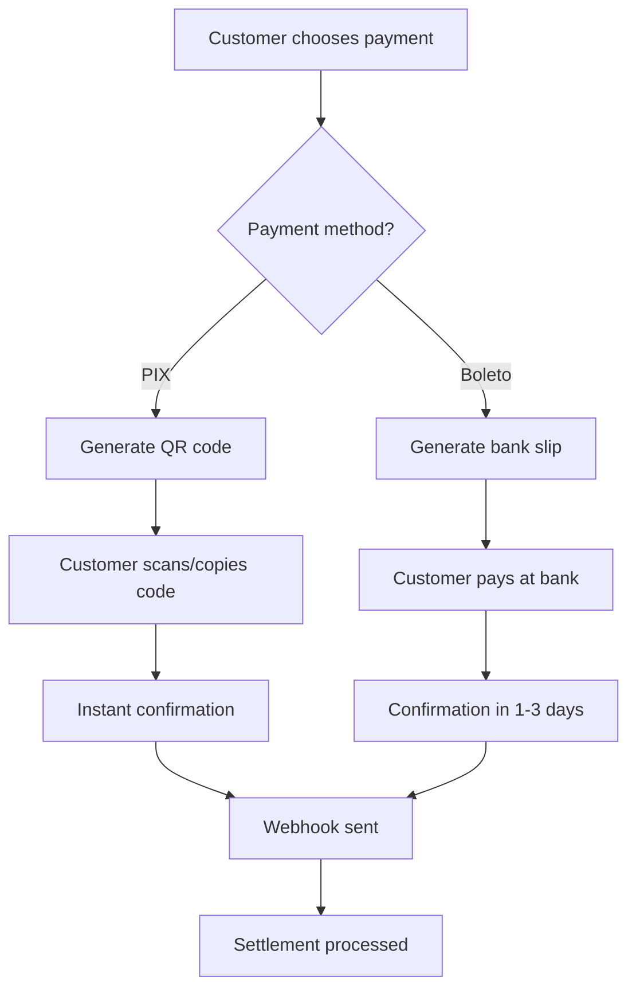

## Supported Payment Methods

Debita AI supports all major Brazilian payment methods with full compliance to local banking regulations and Central Bank requirements.

<CardGroup cols={2}>
  <Card
    title="PIX"
    icon="zap"
    href="/payment-methods/pix"
  >
    **Instant payments 24/7/365**

    QR codes, copy & paste, or direct transfer
    Settlement: D+0 (immediate)
  </Card>
  <Card
    title="Boleto"
    icon="receipt"
    href="/payment-methods/boleto"
  >
    **Bank slip payments**

    Traditional Brazilian payment method
    Settlement: D+1 (next business day)
  </Card>
</CardGroup>

## Payment Method Comparison

| Feature | PIX | Boleto |
|---------|-----|--------|
| **Processing Time** | Instant | Up to 3 business days |
| **Settlement** | D+0 | D+1 |
| **Availability** | 24/7/365 | Business hours |
| **Customer Experience** | QR code or copy/paste | Print and pay at bank |
| **Transaction Fee** | Low | Low |
| **Refund Time** | Instant | 5-10 business days |
| **Min Amount** | R$ 0,01 | R$ 5,00 |
| **Max Amount** | R$ 20.000,00* | R$ 100.000,00 |

<Info>
*PIX limits can be higher for verified business accounts
</Info>

## Regional Considerations

### PIX Adoption
- **95%+ of Brazilian adults** have access to PIX
- **Most popular payment method** for online purchases in Brazil
- **Instant confirmation** makes it ideal for digital goods and services

### Boleto Usage
- Traditional payment method trusted by all age groups
- Popular for **high-value transactions** and B2B payments
- Widely accepted at **banks, pharmacies, and lottery shops**
- No bank account required - pay with cash

## Choosing the Right Payment Method

<AccordionGroup>
  <Accordion title="For Instant Payments" icon="lightning">
    **Recommended: PIX**

    Perfect for:
    - Digital products and services
    - Event tickets
    - Online subscriptions
    - Small to medium transactions
  </Accordion>

  <Accordion title="For Large Transactions" icon="money-bill">
    **Recommended: Boleto or Credit Card**

    Perfect for:
    - High-value purchases (> R$ 1.000)
    - B2B payments
    - Customers who prefer traditional methods
  </Accordion>

  <Accordion title="For Maximum Coverage" icon="shield">
    **Recommended: PIX + Boleto**

    Offer both payment methods to maximize conversion:
    - PIX for instant payments and younger demographics
    - Boleto for traditional users and larger transactions
    - Payment Links for versatile checkout experiences
  </Accordion>
</AccordionGroup>

## Implementation Strategy

### 1. Start with PIX
Begin with PIX for the best customer experience:

```javascript
const charge = await debita.charges.create({
  customer_id: 'cus_123',
  amount: 5000, // R$ 50,00
  currency: 'BRL',
  payment_method: ['pix'],
  description: 'Premium subscription'
});
```

### 2. Add Boleto for Coverage
Include Boleto for customers who prefer traditional methods:

```javascript
const charge = await debita.charges.create({
  customer_id: 'cus_123',
  amount: 15000, // R$ 150,00
  currency: 'BRL',
  payment_method: ['pix', 'boleto'],
  description: 'Annual subscription'
});
```

### 3. Enable Both Methods
For maximum conversion, enable PIX and Boleto:

```javascript
const charge = await debita.charges.create({
  customer_id: 'cus_123',
  amount: 25000, // R$ 250,00
  currency: 'BRL',
  payment_method: ['pix', 'boleto'],
  description: 'Premium package'
});
```

## Payment Flow



## Market Insights

### Payment Preferences by Age Group

<CardGroup cols={2}>
  <Card title="18-30 years" icon="mobile">
    **PIX: 95%**

    Boleto: 5%
    (Prefers instant, mobile-first payments)
  </Card>
  <Card title="31-50 years" icon="balance-scale">
    **PIX: 70%**

    Boleto: 30%
    (Mix of convenience and traditional methods)
  </Card>
  <Card title="50+ years" icon="landmark">
    **Boleto: 60%**

    PIX: 40%
    (Trusts traditional banking methods)
  </Card>
</CardGroup>

### Transaction Value Patterns

- **< R$ 50**: 95% PIX, 5% Boleto (micro-payments)
- **R$ 50-500**: 75% PIX, 25% Boleto (medium transactions)
- **> R$ 500**: 50% PIX, 50% Boleto (high-value transactions)

## Fees and Pricing

Contact our sales team for detailed pricing information:

<CardGroup cols={2}>
  <Card title="Transparent Pricing" icon="eye">
    No hidden fees, clear pricing structure based on payment method and volume
  </Card>
  <Card title="Volume Discounts" icon="trending-down">
    Lower rates for higher transaction volumes and committed contracts
  </Card>
</CardGroup>

## Next Steps

<CardGroup cols={2}>
  <Card
    title="PIX Integration"
    icon="zap"
    href="/payment-methods/pix"
  >
    Learn how to implement PIX payments
  </Card>
  <Card
    title="Quick Start"
    icon="rocket"
    href="/quickstart"
  >
    Start accepting payments in 10 minutes
  </Card>
</CardGroup>