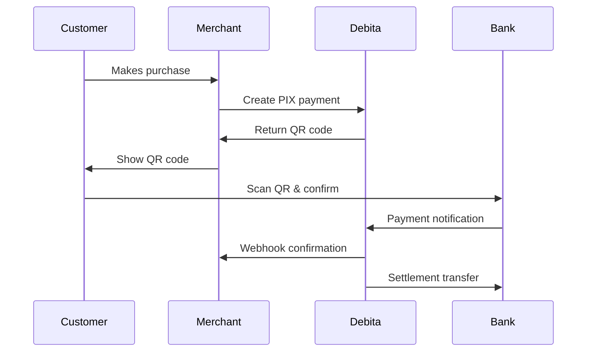
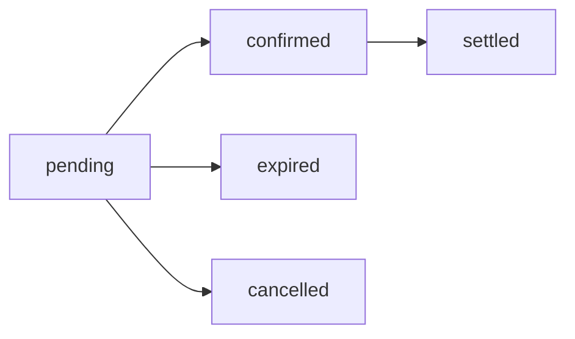

## What is PIX?

PIX is Brazil's instant payment system launched by the Central Bank in 2020. It enables 24/7/365 instant money transfers between bank accounts, making it the fastest-growing payment method in Brazil with over 95% adoption rate.

<CardGroup cols={3}>
  <Card title="Instant Payments" icon="zap">
    Payments are confirmed within seconds, available 24/7/365
  </Card>
  <Card title="QR Codes" icon="qrcode">
    Easy payments by scanning QR codes with any bank app
  </Card>
  <Card title="No Fees" icon="hand-holding-dollar">
    Free for individuals, low cost for businesses
  </Card>
</CardGroup>

## How PIX Works



## Creating PIX Payments

### Step 1: Create a Charge

<CodeGroup>
```bash curl
curl -X POST https://api.debita.ai/v1/charges \
  -H "Authorization: Bearer pk_test_your_key" \
  -H "Content-Type: application/json" \
  -d '{
    "customer_id": "cus_123",
    "amount": 5000,
    "currency": "BRL",
    "description": "Premium subscription",
    "payment_method": ["pix"]
  }'
```

```javascript Node.js
const debita = require('debita-node')('pk_test_your_key');

const charge = await debita.charges.create({
  customer_id: 'cus_123',
  amount: 5000, // R$ 50,00 in cents
  currency: 'BRL',
  description: 'Premium subscription',
  payment_method: ['pix']
});
```

```python Python
import debita

debita.api_key = "pk_test_your_key"

charge = debita.Charge.create(
    customer_id="cus_123",
    amount=5000,  # R$ 50,00 in cents
    currency="BRL",
    description="Premium subscription",
    payment_method=["pix"]
)
```

```php PHP
<?php
\Debita\Debita::setApiKey('pk_test_your_key');

$charge = \Debita\Charge::create([
    'customer_id' => 'cus_123',
    'amount' => 5000, // R$ 50,00 in cents
    'currency' => 'BRL',
    'description' => 'Premium subscription',
    'payment_method' => ['pix']
]);
```
</CodeGroup>

### Step 2: Generate PIX QR Code

<CodeGroup>
```bash curl
curl -X POST https://api.debita.ai/v1/charges/ch_123/pix \
  -H "Authorization: Bearer pk_test_your_key" \
  -H "Content-Type: application/json" \
  -d '{
    "expires_in": 3600,
    "additional_info": [
      {
        "name": "Product",
        "value": "Premium subscription"
      }
    ]
  }'
```

```javascript Node.js
const pixPayment = await debita.charges.createPixPayment('ch_123', {
  expires_in: 3600, // 1 hour
  additional_info: [
    { name: 'Product', value: 'Premium subscription' }
  ]
});

console.log('QR Code URL:', pixPayment.qr_code);
console.log('Copy & Paste:', pixPayment.qr_code_text);
```

```python Python
pix_payment = charge.create_pix_payment(
    expires_in=3600,  # 1 hour
    additional_info=[
        {"name": "Product", "value": "Premium subscription"}
    ]
)

print(f"QR Code URL: {pix_payment.qr_code}")
print(f"Copy & Paste: {pix_payment.qr_code_text}")
```

```php PHP
$pixPayment = $charge->createPixPayment([
    'expires_in' => 3600, // 1 hour
    'additional_info' => [
        ['name' => 'Product', 'value' => 'Premium subscription']
    ]
]);

echo "QR Code URL: " . $pixPayment->qr_code;
echo "Copy & Paste: " . $pixPayment->qr_code_text;
```
</CodeGroup>

### Response Example

```json
{
  "id": "pix_1234567890abcdef",
  "charge_id": "ch_1234567890abcdef",
  "txid": "e3b0c44298fc1c14",
  "end_to_end_id": "E12345678202312151000000001",
  "qr_code": "https://api.debita.ai/v1/pix/qr/pix_1234567890abcdef.png",
  "qr_code_text": "00020126580014br.gov.bcb.pix0136...",
  "expires_at": "2024-12-15T11:00:00Z",
  "status": "pending",
  "amount": 5000,
  "additional_info": [
    {
      "name": "Product",
      "value": "Premium subscription"
    }
  ],
  "created_at": "2024-12-15T10:00:00Z"
}
```

## Displaying PIX to Customers

### Option 1: QR Code Image

Display the QR code image for customers to scan:

```html
<div class="pix-payment">
  <h3>Pay with PIX</h3>
  
  <p>Scan with your bank app</p>
  <p><strong>Amount:</strong> R$ 50,00</p>
  <p><strong>Expires in:</strong> <span id="countdown">59:59</span></p>
</div>
```

### Option 2: Copy & Paste Code

For customers who prefer typing the code:

```html
<div class="pix-copy-paste">
  <h4>Or copy and paste this code:</h4>
  <div class="copy-container">
    <input
      type="text"
      value="00020126580014br.gov.bcb.pix0136..."
      readonly
      id="pix-code"
    />
    <button onclick="copyPixCode()">Copy</button>
  </div>
</div>

<script>
function copyPixCode() {
  const codeInput = document.getElementById('pix-code');
  codeInput.select();
  navigator.clipboard.writeText(codeInput.value);
  alert('PIX code copied!');
}
</script>
```

### Option 3: Complete Payment Interface

Full-featured payment interface:

```html
<div class="pix-payment-container">
  <div class="payment-header">
    <h2>Complete your payment</h2>
    <div class="amount">R$ 50,00</div>
  </div>

  <div class="payment-methods">
    <button class="method active" data-method="qr">
      📱 Scan QR Code
    </button>
    <button class="method" data-method="copy">
      📋 Copy & Paste
    </button>
  </div>

  <div id="qr-method" class="method-content">
    
    <p>Open your bank app and scan the QR code</p>
  </div>

  <div id="copy-method" class="method-content" style="display: none;">
    <label>PIX Copy & Paste Code:</label>
    <div class="copy-container">
      <input type="text" value="..." readonly />
      <button>Copy</button>
    </div>
    <p>Copy this code and paste in your bank app</p>
  </div>

  <div class="payment-info">
    <div class="countdown">
      ⏱️ Expires in <span id="timer">59:59</span>
    </div>
    <div class="status">
      ⏳ Waiting for payment confirmation...
    </div>
  </div>
</div>
```

## PIX Parameters

### Required Parameters
<ResponseField name="charge_id" type="string" required>
  The ID of the charge to create the PIX payment for
</ResponseField>

### Optional Parameters
<ResponseField name="expires_in" type="integer">
  Expiration time in seconds (default: 3600, max: 86400)
</ResponseField>

<ResponseField name="additional_info" type="array">
  Additional information to display to the customer
</ResponseField>

<ResponseField name="payer" type="object">
  Payer information for better transaction tracking
</ResponseField>

## PIX Status Flow

PIX payments go through several status changes:



<AccordionGroup>
  <Accordion title="pending" icon="clock">
    PIX payment was created and is waiting for customer payment
  </Accordion>

  <Accordion title="confirmed" icon="check">
    Customer has paid and the payment was confirmed by the bank
  </Accordion>

  <Accordion title="expired" icon="x">
    Payment expired before customer completed the transaction
  </Accordion>

  <Accordion title="cancelled" icon="ban">
    Payment was cancelled by the merchant or system
  </Accordion>

  <Accordion title="settled" icon="money-bill-transfer">
    Payment has been settled to the merchant's account
  </Accordion>
</AccordionGroup>

## Webhooks for PIX

Set up webhooks to receive real-time notifications:

### Key Events
- `pix.payment.confirmed` - Customer has paid
- `pix.payment.expired` - Payment expired
- `pix.payment.settled` - Payment settled to your account

### Example Webhook Payload

```json
{
  "id": "evt_1234567890abcdef",
  "type": "pix.payment.confirmed",
  "created": "2024-12-15T10:05:30Z",
  "data": {
    "object": {
      "id": "pix_1234567890abcdef",
      "charge_id": "ch_1234567890abcdef",
      "status": "confirmed",
      "amount": 5000,
      "end_to_end_id": "E12345678202312151000000001",
      "paid_at": "2024-12-15T10:05:25Z"
    }
  }
}
```

### Handling Webhooks

<CodeGroup>
```javascript Node.js Express
app.post('/webhook', express.raw({type: 'application/json'}), (req, res) => {
  const event = JSON.parse(req.body);

  switch (event.type) {
    case 'pix.payment.confirmed':
      const payment = event.data.object;
      console.log(`PIX payment confirmed: ${payment.id}`);

      // Update your database
      updateOrderStatus(payment.charge_id, 'paid');

      // Send confirmation email
      sendConfirmationEmail(payment.charge_id);
      break;

    case 'pix.payment.expired':
      console.log(`PIX payment expired: ${event.data.object.id}`);
      // Handle expired payment
      break;
  }

  res.sendStatus(200);
});
```

```python Python Flask
@app.route('/webhook', methods=['POST'])
def handle_webhook():
    event = request.get_json()

    if event['type'] == 'pix.payment.confirmed':
        payment = event['data']['object']
        print(f"PIX payment confirmed: {payment['id']}")

        # Update your database
        update_order_status(payment['charge_id'], 'paid')

        # Send confirmation email
        send_confirmation_email(payment['charge_id'])

    elif event['type'] == 'pix.payment.expired':
        print(f"PIX payment expired: {event['data']['object']['id']}")
        # Handle expired payment

    return '', 200
```
</CodeGroup>

## PIX Limits and Compliance

### Transaction Limits
- **Minimum**: R$ 0,01
- **Maximum (Individual)**: R$ 20.000,00 per transaction
- **Maximum (Business)**: R$ 100.000,00 per transaction
- **Daily Limit**: Varies by bank and account type

### Compliance Features
- **BACEN Compliance**: Full compliance with Central Bank regulations
- **Anti-Money Laundering**: Automatic AML screening
- **Transaction Monitoring**: Real-time fraud detection
- **LGPD Compliance**: Data protection and privacy

## Testing PIX

### Test Environment
In test mode (`pk_test_`), PIX payments are automatically confirmed after 10 seconds:

```javascript
// Create test PIX payment
const pixPayment = await debita.charges.createPixPayment('ch_test_123', {
  expires_in: 3600
});

// Will be automatically confirmed after 10 seconds
setTimeout(() => {
  console.log('Test PIX payment confirmed!');
}, 10000);
```

### Test PIX Codes
Use these test values for integration testing:

```json
{
  "test_scenarios": {
    "successful_payment": {
      "qr_code_text": "00020126580014br.gov.bcb.pix0136test_success_code"
    },
    "expired_payment": {
      "qr_code_text": "00020126580014br.gov.bcb.pix0136test_expired_code"
    },
    "failed_payment": {
      "qr_code_text": "00020126580014br.gov.bcb.pix0136test_failed_code"
    }
  }
}
```

## Best Practices

<AccordionGroup>
  <Accordion title="User Experience" icon="user">
    - Always show both QR code and copy/paste options
    - Include clear expiration countdown
    - Provide real-time payment status updates
    - Show payment amount prominently
  </Accordion>

  <Accordion title="Technical Implementation" icon="code">
    - Use webhooks for real-time status updates
    - Implement proper error handling
    - Cache QR code images for better performance
    - Set appropriate expiration times (1-2 hours max)
  </Accordion>

  <Accordion title="Security" icon="shield">
    - Validate webhook signatures
    - Use HTTPS for all PIX-related endpoints
    - Never store sensitive PIX data
    - Monitor for unusual payment patterns
  </Accordion>

  <Accordion title="Business Logic" icon="briefcase">
    - Handle expired payments gracefully
    - Provide clear refund policies
    - Monitor settlement times
    - Track conversion rates by payment method
  </Accordion>
</AccordionGroup>

## Common Issues and Solutions

<AccordionGroup>
  <Accordion title="QR Code Not Loading" icon="image">
    **Problem**: QR code image fails to load

    **Solution**:
    ```javascript
    // Add error handling for QR code
    const img = document.getElementById('qr-code');
    img.onerror = function() {
      // Fallback to copy/paste only
      showCopyPasteOnly();
    };
    ```
  </Accordion>

  <Accordion title="Payment Not Confirming" icon="clock">
    **Problem**: Customer paid but status is still pending

    **Solution**: PIX confirmation can take up to 1 hour in rare cases. Always rely on webhooks for status updates.
  </Accordion>

  <Accordion title="Expired Payments" icon="x">
    **Problem**: High rate of expired payments

    **Solution**:
    - Reduce expiration time to create urgency
    - Send reminder notifications
    - Implement automatic payment retry
  </Accordion>
</AccordionGroup>

## Next Steps

<CardGroup cols={2}>
  <Card
    title="Webhooks Setup"
    icon="webhook"
    href="/webhooks"
  >
    Configure webhooks for real-time notifications
  </Card>
  <Card
    title="Boleto Integration"
    icon="receipt"
    href="/payment-methods/boleto"
  >
    Add Boleto as a backup payment method
  </Card>
</CardGroup>