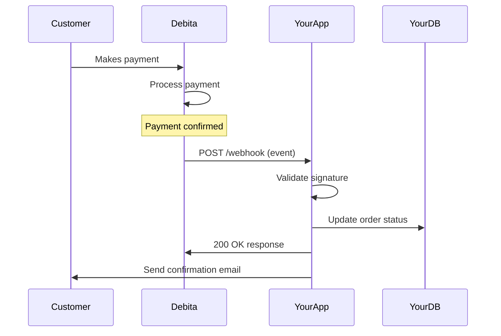

## What are Webhooks?

Webhooks are HTTP POST requests that Debita AI sends to your server when specific events occur in your account. Instead of constantly polling our API for updates, webhooks provide real-time notifications about payment confirmations, failures, refunds, and other important events.

<CardGroup cols={3}>
  <Card title="Real-time Updates" icon="bell">
    Get notified instantly when events occur, no polling required
  </Card>
  <Card title="Reliable Delivery" icon="shield">
    Built-in retry mechanism ensures you receive all events
  </Card>
  <Card title="Secure" icon="lock">
    HMAC signatures verify event authenticity
  </Card>
</CardGroup>

## How Webhooks Work



## Quick Setup

<Steps>
  <Step title="Configure endpoint URL">
    Set your webhook endpoint URL in the dashboard:

    ```
    https://your-app.com/webhook
    ```
  </Step>

  <Step title="Create webhook handler">
    Create an endpoint to receive webhook events:

    <CodeGroup>
    ```javascript Node.js Express
    const express = require('express');
    const crypto = require('crypto');

    app.post('/webhook', express.raw({type: 'application/json'}), (req, res) => {
      const signature = req.get('Debita-Signature');
      const body = req.body;

      // Verify webhook signature
      if (!verifyWebhookSignature(body, signature)) {
        return res.status(400).send('Invalid signature');
      }

      const event = JSON.parse(body);
      console.log('Received event:', event.type);

      // Handle the event
      handleWebhookEvent(event);

      res.sendStatus(200);
    });
    ```

    ```python Python Flask
    import hmac
    import hashlib
    from flask import Flask, request

    @app.route('/webhook', methods=['POST'])
    def handle_webhook():
        signature = request.headers.get('Debita-Signature')
        body = request.data

        # Verify webhook signature
        if not verify_webhook_signature(body, signature):
            return 'Invalid signature', 400

        event = request.get_json()
        print(f'Received event: {event["type"]}')

        # Handle the event
        handle_webhook_event(event)

        return '', 200
    ```

    ```php PHP
    <?php
    $signature = $_SERVER['HTTP_DEBITA_SIGNATURE'];
    $body = file_get_contents('php://input');

    // Verify webhook signature
    if (!verifyWebhookSignature($body, $signature)) {
        http_response_code(400);
        exit('Invalid signature');
    }

    $event = json_decode($body, true);
    error_log('Received event: ' . $event['type']);

    // Handle the event
    handleWebhookEvent($event);

    http_response_code(200);
    ?>
    ```
    </CodeGroup>
  </Step>

  <Step title="Handle events">
    Process different event types in your application:

    ```javascript
    function handleWebhookEvent(event) {
      switch (event.type) {
        case 'payment.confirmed':
          handlePaymentConfirmed(event.data);
          break;
        case 'payment.failed':
          handlePaymentFailed(event.data);
          break;
        case 'refund.processed':
          handleRefundProcessed(event.data);
          break;
        default:
          console.log(`Unhandled event type: ${event.type}`);
      }
    }
    ```
  </Step>

  <Step title="Test your webhook">
    Use our webhook testing tool in the dashboard to send test events to your endpoint.
  </Step>
</Steps>

## Common Webhook Events

### Payment Events
<AccordionGroup>
  <Accordion title="payment.confirmed" icon="check-circle">
    **When**: A payment is successfully confirmed
    **Action**: Update order status, send confirmation email, fulfill order

    ```json
    {
      "type": "payment.confirmed",
      "data": {
        "id": "pay_123",
        "charge_id": "ch_123",
        "amount": 5000,
        "method": "pix",
        "confirmed_at": "2024-12-15T10:30:00Z"
      }
    }
    ```
  </Accordion>

  <Accordion title="payment.failed" icon="x-circle">
    **When**: A payment fails or is declined
    **Action**: Update order status, notify customer, offer alternative payment

    ```json
    {
      "type": "payment.failed",
      "data": {
        "id": "pay_123",
        "charge_id": "ch_123",
        "failure_reason": "insufficient_funds",
        "failed_at": "2024-12-15T10:30:00Z"
      }
    }
    ```
  </Accordion>

  <Accordion title="payment.expired" icon="clock">
    **When**: A payment expires before completion
    **Action**: Update order status, offer new payment link

    ```json
    {
      "type": "payment.expired",
      "data": {
        "id": "pay_123",
        "charge_id": "ch_123",
        "expired_at": "2024-12-15T11:30:00Z"
      }
    }
    ```
  </Accordion>
</AccordionGroup>

### Transaction Events
<AccordionGroup>
  <Accordion title="transaction.settled" icon="money-bill-transfer">
    **When**: Funds are settled to your account
    **Action**: Update financial records, reconcile accounts

    ```json
    {
      "type": "transaction.settled",
      "data": {
        "id": "txn_123",
        "amount": 4750, // After fees
        "original_amount": 5000,
        "fee": 250,
        "settled_at": "2024-12-16T08:00:00Z"
      }
    }
    ```
  </Accordion>

  <Accordion title="refund.processed" icon="rotate-left">
    **When**: A refund is successfully processed
    **Action**: Update order status, notify customer

    ```json
    {
      "type": "refund.processed",
      "data": {
        "id": "ref_123",
        "charge_id": "ch_123",
        "amount": 2500, // Partial refund
        "reason": "customer_request",
        "processed_at": "2024-12-15T14:00:00Z"
      }
    }
    ```
  </Accordion>
</AccordionGroup>

## Webhook Event Structure

All webhook events follow this structure:

```json
{
  "id": "evt_1234567890abcdef",
  "type": "payment.confirmed",
  "api_version": "2024-11-01",
  "created": "2024-12-15T10:30:00Z",
  "data": {
    "object": {
      // Event-specific data
    }
  },
  "livemode": false,
  "pending_webhooks": 1,
  "request": {
    "id": "req_1234567890abcdef",
    "idempotency_key": null
  }
}
```

### Event Fields
<ResponseField name="id" type="string">
  Unique identifier for the event
</ResponseField>

<ResponseField name="type" type="string">
  The type of event (e.g., `payment.confirmed`)
</ResponseField>

<ResponseField name="api_version" type="string">
  The API version used to render the event
</ResponseField>

<ResponseField name="created" type="timestamp">
  When the event was created
</ResponseField>

<ResponseField name="data.object" type="object">
  The object that triggered the event
</ResponseField>

<ResponseField name="livemode" type="boolean">
  Whether this event was generated in live mode
</ResponseField>

## Signature Verification

Always verify webhook signatures to ensure events come from Debita AI:

<CodeGroup>
```javascript Node.js
const crypto = require('crypto');

function verifyWebhookSignature(body, signature, secret) {
  const expectedSignature = crypto
    .createHmac('sha256', secret)
    .update(body)
    .digest('hex');

  return crypto.timingSafeEqual(
    Buffer.from(signature.replace('sha256=', '')),
    Buffer.from(expectedSignature)
  );
}

// Usage
const webhookSecret = process.env.DEBITA_WEBHOOK_SECRET;
const isValid = verifyWebhookSignature(req.body, signature, webhookSecret);
```

```python Python
import hmac
import hashlib

def verify_webhook_signature(body, signature, secret):
    expected_signature = hmac.new(
        secret.encode('utf-8'),
        body,
        hashlib.sha256
    ).hexdigest()

    return hmac.compare_digest(
        signature.replace('sha256=', ''),
        expected_signature
    )

# Usage
webhook_secret = os.getenv('DEBITA_WEBHOOK_SECRET')
is_valid = verify_webhook_signature(body, signature, webhook_secret)
```

```php PHP
<?php
function verifyWebhookSignature($body, $signature, $secret) {
    $expectedSignature = hash_hmac('sha256', $body, $secret);
    $receivedSignature = str_replace('sha256=', '', $signature);

    return hash_equals($expectedSignature, $receivedSignature);
}

// Usage
$webhookSecret = $_ENV['DEBITA_WEBHOOK_SECRET'];
$isValid = verifyWebhookSignature($body, $signature, $webhookSecret);
?>
```
</CodeGroup>

## Retry Logic

If your endpoint doesn't respond with a 2xx status code, Debita AI will retry the webhook:

<CardGroup cols={3}>
  <Card title="Immediate" icon="1">
    First retry immediately
  </Card>
  <Card title="5 minutes" icon="2">
    Second retry after 5 minutes
  </Card>
  <Card title="1 hour" icon="3">
    Final retry after 1 hour
  </Card>
</CardGroup>

### Retry Headers

Retried webhooks include additional headers:

```http
Debita-Delivery-Attempt: 2
Debita-Delivery-ID: delivery_1234567890abcdef
```

### Handling Retries

Implement idempotency to handle duplicate events:

```javascript
const processedEvents = new Set();

function handleWebhookEvent(event) {
  // Check if already processed
  if (processedEvents.has(event.id)) {
    console.log(`Event ${event.id} already processed`);
    return;
  }

  // Process the event
  processEvent(event);

  // Mark as processed
  processedEvents.add(event.id);
}
```

## Error Handling

### Common Webhook Issues

<AccordionGroup>
  <Accordion title="Timeout Errors" icon="clock">
    **Problem**: Your endpoint takes too long to respond (>30 seconds)

    **Solution**:
    ```javascript
    app.post('/webhook', (req, res) => {
      // Respond quickly
      res.sendStatus(200);

      // Process asynchronously
      setImmediate(() => {
        processWebhookEvent(req.body);
      });
    });
    ```
  </Accordion>

  <Accordion title="Invalid Signature" icon="shield-exclamation">
    **Problem**: Signature verification fails

    **Solution**: Check your webhook secret and ensure you're using the raw request body.
  </Accordion>

  <Accordion title="Missing Events" icon="question">
    **Problem**: Not receiving expected webhook events

    **Solution**: Check your webhook configuration in the dashboard and test with the webhook testing tool.
  </Accordion>
</AccordionGroup>

### Webhook Monitoring

Monitor your webhook endpoint health:

```javascript
// Track webhook processing
const webhookMetrics = {
  received: 0,
  processed: 0,
  errors: 0
};

app.post('/webhook', (req, res) => {
  webhookMetrics.received++;

  try {
    const event = JSON.parse(req.body);
    handleWebhookEvent(event);
    webhookMetrics.processed++;
    res.sendStatus(200);
  } catch (error) {
    webhookMetrics.errors++;
    console.error('Webhook error:', error);
    res.status(500).send('Internal error');
  }
});

// Health check endpoint
app.get('/webhook/health', (req, res) => {
  res.json(webhookMetrics);
});
```

## Best Practices

<AccordionGroup>
  <Accordion title="Security" icon="shield">
    - Always verify webhook signatures
    - Use HTTPS for your webhook endpoint
    - Don't expose sensitive data in logs
    - Implement rate limiting
  </Accordion>

  <Accordion title="Reliability" icon="circle-check">
    - Respond with 200 status code quickly
    - Process events asynchronously
    - Implement idempotency
    - Handle retries gracefully
  </Accordion>

  <Accordion title="Monitoring" icon="chart-line">
    - Log all webhook events
    - Monitor processing times
    - Set up alerts for failures
    - Track event delivery rates
  </Accordion>

  <Accordion title="Testing" icon="flask">
    - Test with webhook testing tool
    - Simulate different event types
    - Test error scenarios
    - Verify signature validation
  </Accordion>
</AccordionGroup>

## Development and Testing

### Local Development

Use ngrok or similar tools to expose your local server:

```bash
# Install ngrok
npm install -g ngrok

# Expose local port
ngrok http 3000

# Use the HTTPS URL in your webhook configuration
# https://abc123.ngrok.io/webhook
```

### Testing Framework

Create a webhook testing framework:

```javascript
const express = require('express');
const app = express();

// Test webhook endpoint
app.post('/webhook/test', express.json(), (req, res) => {
  const event = req.body;

  console.log(`Test event received: ${event.type}`);
  console.log('Event data:', JSON.stringify(event.data, null, 2));

  // Validate event structure
  if (!event.type || !event.data) {
    return res.status(400).send('Invalid event structure');
  }

  res.sendStatus(200);
});

app.listen(3000, () => {
  console.log('Test webhook server running on port 3000');
});
```

## Next Steps

<CardGroup cols={2}>
  <Card
    title="Setup Guide"
    icon="gear"
    href="/webhooks/setup"
  >
    Detailed webhook configuration guide
  </Card>
  <Card
    title="Event Reference"
    icon="list"
    href="/webhooks/events"
  >
    Complete list of all webhook events
  </Card>
  <Card
    title="Security Guide"
    icon="lock"
    href="/webhooks/security"
  >
    Advanced security and verification
  </Card>
  <Card
    title="Testing Guide"
    icon="flask"
    href="/webhooks/testing"
  >
    Testing webhooks in development
  </Card>
</CardGroup>