# Segurança de Webhooks

A validação adequada de webhooks é **crítica** para a segurança da sua aplicação. Este guia apresenta implementações robustas de validação HMAC SHA-256 e proteções contra ataques comuns.

## 🛡️ Por que Validar Webhooks?

### Ameaças Sem Validação

<CardGroup cols={2}>
  <Card title="Man-in-the-Middle" icon="network-wired">
    Atacante intercepta e modifica dados do webhook
  </Card>
  <Card title="Replay Attack" icon="repeat">
    Reenvio de webhooks antigos para causar ações duplicadas
  </Card>
  <Card title="Spoofing" icon="mask">
    Webhooks falsos enviados por atacantes
  </Card>
  <Card title="Data Tampering" icon="edit">
    Modificação de valores como amount, status, etc.
  </Card>
</CardGroup>

### Benefícios da Validação

- ✅ **Autenticidade**: Confirma origem da Debita AI
- ✅ **Integridade**: Garante que dados não foram modificados
- ✅ **Não-repúdio**: Comprova legitimidade do evento
- ✅ **Prevenção de replay**: Evita processamento duplicado

## 🔐 Algoritmo HMAC SHA-256

### Como Funciona

```mermaid
graph TD
    A[Webhook Secret] --> B[HMAC SHA-256]
    C[Timestamp + Payload] --> B
    B --> D[Signature]
    D --> E[Header X-Debita-Signature]

    F[Seu Servidor] --> G[Recalcular HMAC]
    C --> G
    A --> G
    G --> H[Comparar Signatures]
    E --> H
    H --> I{Válido?}
    I -->|Sim| J[Processar Webhook]
    I -->|Não| K[Rejeitar - 401]
```



### Construção da Assinatura

A Debita AI constrói a assinatura da seguinte forma:

```
message = timestamp + '.' + raw_body
signature = 'sha256=' + hmac_sha256(webhook_secret, message)
```

## 🔧 Implementação Segura

### Node.js - Implementação Robusta

```javascript
// secure-webhook-validator.js
const crypto = require('crypto');

class SecureWebhookValidator {
  constructor(secret) {
    if (!secret) {
      throw new Error('Webhook secret é obrigatório');
    }
    this.secret = secret;
    this.maxTimestampAge = 300; // 5 minutos
  }

  validate(rawBody, signature, timestamp, options = {}) {
    try {
      // 1. Validações básicas
      this._validateInputs(rawBody, signature, timestamp);

      // 2. Verificar timestamp (proteção contra replay)
      this._validateTimestamp(timestamp, options.allowOldTimestamps);

      // 3. Validar formato da assinatura
      this._validateSignatureFormat(signature);

      // 4. Calcular e comparar HMAC
      this._validateHMAC(rawBody, signature, timestamp);

      return true;
    } catch (error) {
      // Log de segurança (sem expor dados sensíveis)
      this._logSecurityEvent('validation_failed', {
        error: error.message,
        timestamp: timestamp,
        hasSignature: !!signature,
        bodyLength: rawBody ? rawBody.length : 0
      });

      throw error;
    }
  }

  _validateInputs(rawBody, signature, timestamp) {
    if (typeof rawBody !== 'string' && !Buffer.isBuffer(rawBody)) {
      throw new Error('Raw body deve ser string ou Buffer');
    }

    if (!signature) {
      throw new Error('Header X-Debita-Signature ausente');
    }

    if (!timestamp) {
      throw new Error('Header X-Debita-Timestamp ausente');
    }

    if (!/^\d+$/.test(timestamp)) {
      throw new Error('Timestamp deve ser numérico');
    }
  }

  _validateTimestamp(timestamp, allowOld = false) {
    if (allowOld) return;

    const currentTime = Math.floor(Date.now() / 1000);
    const webhookTime = parseInt(timestamp, 10);
    const timeDiff = Math.abs(currentTime - webhookTime);

    if (timeDiff > this.maxTimestampAge) {
      throw new Error(`Timestamp muito antigo: ${timeDiff}s (máx: ${this.maxTimestampAge}s)`);
    }

    // Proteção contra timestamps futuros (clock skew)
    if (webhookTime > currentTime + 60) {
      throw new Error('Timestamp no futuro detectado');
    }
  }

  _validateSignatureFormat(signature) {
    if (!signature.startsWith('sha256=')) {
      throw new Error('Formato de assinatura inválido - deve começar com "sha256="');
    }

    const hash = signature.slice(7); // Remove 'sha256='

    if (!/^[a-f0-9]{64}$/i.test(hash)) {
      throw new Error('Hash SHA-256 inválido - deve conter 64 chars hexadecimais');
    }
  }

  _validateHMAC(rawBody, signature, timestamp) {
    const message = `${timestamp}.${rawBody}`;
    const hmac = crypto.createHmac('sha256', this.secret);
    hmac.update(message, 'utf8');
    const expectedSignature = 'sha256=' + hmac.digest('hex');

    // Comparação timing-safe (previne timing attacks)
    const isValid = crypto.timingSafeEqual(
      Buffer.from(expectedSignature, 'utf8'),
      Buffer.from(signature, 'utf8')
    );

    if (!isValid) {
      throw new Error('Assinatura HMAC inválida');
    }
  }

  _logSecurityEvent(event, details) {
    const logEntry = {
      timestamp: new Date().toISOString(),
      event: `webhook_security_${event}`,
      source: 'webhook_validator',
      details: details,
      severity: 'warning'
    };

    // Use seu sistema de logging (Winston, Bunyan, etc.)
    console.warn('SECURITY:', JSON.stringify(logEntry));
  }

  // Método para debug (apenas desenvolvimento)
  debugValidation(rawBody, signature, timestamp) {
    if (process.env.NODE_ENV === 'production') {
      throw new Error('Debug não permitido em produção');
    }

    const message = `${timestamp}.${rawBody}`;
    const hmac = crypto.createHmac('sha256', this.secret);
    hmac.update(message, 'utf8');
    const calculated = 'sha256=' + hmac.digest('hex');

    return {
      message_constructed: message,
      signature_received: signature,
      signature_calculated: calculated,
      timestamp: timestamp,
      body_length: rawBody.length,
      secret_length: this.secret.length,
      is_valid: signature === calculated
    };
  }
}

module.exports = SecureWebhookValidator;
```

### Middleware Express Seguro

```javascript
// webhook-middleware.js
const SecureWebhookValidator = require('./secure-webhook-validator');

function createWebhookMiddleware(secret, options = {}) {
  const validator = new SecureWebhookValidator(secret);

  return (req, res, next) => {
    // 1. Rate limiting por IP
    if (options.rateLimit && !checkRateLimit(req.ip)) {
      return res.status(429).json({ error: 'Rate limit exceeded' });
    }

    // 2. Verificar Content-Type
    if (req.headers['content-type'] !== 'application/json') {
      return res.status(400).json({ error: 'Content-Type deve ser application/json' });
    }

    // 3. Verificar tamanho do payload
    const maxSize = options.maxPayloadSize || 1024 * 1024; // 1MB default
    if (req.body && req.body.length > maxSize) {
      return res.status(413).json({ error: 'Payload muito grande' });
    }

    try {
      // 4. Validar webhook
      validator.validate(
        req.body.toString(),
        req.headers['x-debita-signature'],
        req.headers['x-debita-timestamp'],
        options
      );

      // 5. Adicionar dados validados ao request
      req.webhook = {
        validated: true,
        timestamp: parseInt(req.headers['x-debita-timestamp']),
        event: req.headers['x-debita-event'],
        webhookId: req.headers['x-debita-webhook-id'],
        deliveryId: req.headers['x-debita-delivery-id']
      };

      next();
    } catch (error) {
      // Log de segurança
      console.warn('Webhook validation failed:', {
        ip: req.ip,
        userAgent: req.headers['user-agent'],
        error: error.message,
        timestamp: new Date().toISOString()
      });

      res.status(401).json({
        error: 'Webhook validation failed',
        message: error.message
      });
    }
  };
}

// Rate limiting simples por IP
const rateLimitMap = new Map();

function checkRateLimit(ip) {
  const now = Date.now();
  const windowMs = 60 * 1000; // 1 minuto
  const maxRequests = 100; // máx 100 req/min por IP

  if (!rateLimitMap.has(ip)) {
    rateLimitMap.set(ip, { count: 1, resetTime: now + windowMs });
    return true;
  }

  const data = rateLimitMap.get(ip);

  if (now > data.resetTime) {
    data.count = 1;
    data.resetTime = now + windowMs;
    return true;
  }

  data.count++;
  return data.count <= maxRequests;
}

module.exports = { createWebhookMiddleware, SecureWebhookValidator };
```

### Implementação Python Segura

```python
# secure_webhook_validator.py
import hashlib
import hmac
import time
import re
from typing import Union, Optional, Dict, Any

class SecureWebhookValidator:
    def __init__(self, secret: str):
        if not secret:
            raise ValueError("Webhook secret é obrigatório")
        self.secret = secret.encode('utf-8')
        self.max_timestamp_age = 300  # 5 minutos

    def validate(
        self,
        raw_body: Union[str, bytes],
        signature: str,
        timestamp: str,
        allow_old_timestamps: bool = False
    ) -> bool:
        try:
            # 1. Validações básicas
            self._validate_inputs(raw_body, signature, timestamp)

            # 2. Verificar timestamp
            self._validate_timestamp(timestamp, allow_old_timestamps)

            # 3. Validar formato da assinatura
            self._validate_signature_format(signature)

            # 4. Validar HMAC
            self._validate_hmac(raw_body, signature, timestamp)

            return True
        except Exception as error:
            self._log_security_event('validation_failed', {
                'error': str(error),
                'timestamp': timestamp,
                'has_signature': bool(signature),
                'body_length': len(raw_body) if raw_body else 0
            })
            raise

    def _validate_inputs(self, raw_body, signature, timestamp):
        if not isinstance(raw_body, (str, bytes)):
            raise ValueError("Raw body deve ser string ou bytes")

        if not signature:
            raise ValueError("Header X-Debita-Signature ausente")

        if not timestamp:
            raise ValueError("Header X-Debita-Timestamp ausente")

        if not re.match(r'^\d+$', str(timestamp)):
            raise ValueError("Timestamp deve ser numérico")

    def _validate_timestamp(self, timestamp: str, allow_old: bool = False):
        if allow_old:
            return

        current_time = int(time.time())
        webhook_time = int(timestamp)
        time_diff = abs(current_time - webhook_time)

        if time_diff > self.max_timestamp_age:
            raise ValueError(f"Timestamp muito antigo: {time_diff}s (máx: {self.max_timestamp_age}s)")

        # Proteção contra timestamps futuros
        if webhook_time > current_time + 60:
            raise ValueError("Timestamp no futuro detectado")

    def _validate_signature_format(self, signature: str):
        if not signature.startswith('sha256='):
            raise ValueError("Formato de assinatura inválido - deve começar com 'sha256='")

        hash_part = signature[7:]  # Remove 'sha256='

        if not re.match(r'^[a-f0-9]{64}$', hash_part, re.IGNORECASE):
            raise ValueError("Hash SHA-256 inválido - deve conter 64 chars hexadecimais")

    def _validate_hmac(self, raw_body: Union[str, bytes], signature: str, timestamp: str):
        if isinstance(raw_body, str):
            raw_body = raw_body.encode('utf-8')

        message = f"{timestamp}.{raw_body.decode('utf-8')}".encode('utf-8')
        expected_signature = 'sha256=' + hmac.new(
            self.secret,
            message,
            hashlib.sha256
        ).hexdigest()

        # Comparação timing-safe
        if not hmac.compare_digest(expected_signature, signature):
            raise ValueError("Assinatura HMAC inválida")

    def _log_security_event(self, event: str, details: Dict[str, Any]):
        import json
        import logging

        log_entry = {
            'timestamp': time.time(),
            'event': f'webhook_security_{event}',
            'source': 'webhook_validator',
            'details': details,
            'severity': 'warning'
        }

        logging.warning(f"SECURITY: {json.dumps(log_entry)}")

# FastAPI middleware
from fastapi import FastAPI, Request, HTTPException
from fastapi.responses import JSONResponse
import asyncio

def create_webhook_middleware(secret: str, max_payload_size: int = 1024 * 1024):
    validator = SecureWebhookValidator(secret)

    async def webhook_middleware(request: Request, call_next):
        # Verificar Content-Type
        content_type = request.headers.get('content-type')
        if content_type != 'application/json':
            return JSONResponse(
                status_code=400,
                content={'error': 'Content-Type deve ser application/json'}
            )

        try:
            # Ler body
            body = await request.body()

            # Verificar tamanho
            if len(body) > max_payload_size:
                return JSONResponse(
                    status_code=413,
                    content={'error': 'Payload muito grande'}
                )

            # Validar webhook
            validator.validate(
                body.decode('utf-8'),
                request.headers.get('x-debita-signature'),
                request.headers.get('x-debita-timestamp')
            )

            # Adicionar dados validados
            request.state.webhook = {
                'validated': True,
                'timestamp': int(request.headers.get('x-debita-timestamp')),
                'event': request.headers.get('x-debita-event'),
                'webhook_id': request.headers.get('x-debita-webhook-id'),
                'delivery_id': request.headers.get('x-debita-delivery-id')
            }

            response = await call_next(request)
            return response

        except Exception as error:
            logging.warning(f'Webhook validation failed: {str(error)}')
            return JSONResponse(
                status_code=401,
                content={
                    'error': 'Webhook validation failed',
                    'message': str(error)
                }
            )

    return webhook_middleware
```

## 🚨 Proteções Contra Ataques

### 1. Replay Attack Prevention

```javascript
// replay-protection.js
class ReplayProtection {
  constructor(redisClient) {
    this.redis = redisClient;
    this.ttl = 600; // 10 minutos
  }

  async checkAndStore(deliveryId, timestamp) {
    const key = `webhook:delivery:${deliveryId}`;

    // Verificar se já foi processado
    const exists = await this.redis.get(key);
    if (exists) {
      throw new Error('Delivery ID já processado (replay attack?)');
    }

    // Armazenar com TTL
    await this.redis.setex(key, this.ttl, timestamp);
  }
}

// Uso no middleware
const replayProtection = new ReplayProtection(redisClient);

app.post('/webhooks/debita', async (req, res) => {
  try {
    // Validação HMAC...

    // Proteção contra replay
    await replayProtection.checkAndStore(
      req.webhook.deliveryId,
      req.webhook.timestamp
    );

    // Processar webhook...
    res.status(200).send('OK');
  } catch (error) {
    if (error.message.includes('replay')) {
      return res.status(409).send('Conflict - Already processed');
    }
    res.status(400).send('Bad Request');
  }
});
```

### 2. Rate Limiting Avançado

```javascript
// advanced-rate-limiting.js
class WebhookRateLimiter {
  constructor(redisClient) {
    this.redis = redisClient;
  }

  async checkLimits(ip, webhookId) {
    const now = Date.now();

    // Limite por IP: 1000 req/hora
    const ipKey = `webhook:rate:ip:${ip}`;
    const ipCount = await this.redis.incr(ipKey);
    if (ipCount === 1) {
      await this.redis.expire(ipKey, 3600); // 1 hora
    }
    if (ipCount > 1000) {
      throw new Error('Rate limit por IP excedido');
    }

    // Limite por webhook: 10000 req/hora
    const webhookKey = `webhook:rate:webhook:${webhookId}`;
    const webhookCount = await this.redis.incr(webhookKey);
    if (webhookCount === 1) {
      await this.redis.expire(webhookKey, 3600);
    }
    if (webhookCount > 10000) {
      throw new Error('Rate limit por webhook excedido');
    }

    // Limite de burst: 100 req/minuto
    const burstKey = `webhook:burst:${ip}`;
    const burstCount = await this.redis.incr(burstKey);
    if (burstCount === 1) {
      await this.redis.expire(burstKey, 60); // 1 minuto
    }
    if (burstCount > 100) {
      throw new Error('Rate limit de burst excedido');
    }
  }
}
```

### 3. IP Whitelist (Opcional)

```javascript
// ip-whitelist.js
class IPWhitelist {
  constructor() {
    // IPs da Debita AI (atualize conforme necessário)
    this.allowedIPs = new Set([
      '52.67.123.45',
      '54.232.178.90',
      '52.67.89.123'
    ]);
  }

  isAllowed(ip) {
    // Em desenvolvimento, permitir localhost
    if (process.env.NODE_ENV === 'development') {
      if (['127.0.0.1', '::1', '::ffff:127.0.0.1'].includes(ip)) {
        return true;
      }
    }

    return this.allowedIPs.has(ip);
  }
}

// Middleware
function ipWhitelistMiddleware(req, res, next) {
  const whitelist = new IPWhitelist();
  const clientIP = req.ip || req.connection.remoteAddress;

  if (!whitelist.isAllowed(clientIP)) {
    console.warn(`Webhook rejeitado - IP não autorizado: ${clientIP}`);
    return res.status(403).json({ error: 'IP not allowed' });
  }

  next();
}
```

## 📊 Monitoramento de Segurança

### Dashboard de Eventos de Segurança

```javascript
// security-monitor.js
class SecurityMonitor {
  constructor(redisClient) {
    this.redis = redisClient;
  }

  async recordSecurityEvent(eventType, details) {
    const event = {
      type: eventType,
      timestamp: Date.now(),
      details: details,
      id: crypto.randomUUID()
    };

    // Armazenar evento
    const key = `security:events:${Date.now()}`;
    await this.redis.setex(key, 86400, JSON.stringify(event)); // 24h TTL

    // Incrementar contador
    const counterKey = `security:counter:${eventType}`;
    await this.redis.incr(counterKey);
    await this.redis.expire(counterKey, 3600); // 1h TTL

    // Alertas automáticos
    await this.checkAlerts(eventType);
  }

  async checkAlerts(eventType) {
    const alertThresholds = {
      'invalid_signature': 10,
      'replay_attack': 5,
      'rate_limit_exceeded': 50,
      'ip_blocked': 3
    };

    if (alertThresholds[eventType]) {
      const count = await this.redis.get(`security:counter:${eventType}`);

      if (parseInt(count) >= alertThresholds[eventType]) {
        await this.sendAlert(eventType, count);
      }
    }
  }

  async sendAlert(eventType, count) {
    // Integrar com seu sistema de alertas (Slack, PagerDuty, etc.)
    console.error(`🚨 ALERTA DE SEGURANÇA: ${eventType} ocorreu ${count} vezes na última hora`);

    // Exemplo: Slack webhook
    // await this.sendSlackAlert(eventType, count);
  }

  async getSecurityStats() {
    const keys = await this.redis.keys('security:counter:*');
    const stats = {};

    for (const key of keys) {
      const eventType = key.split(':').pop();
      stats[eventType] = await this.redis.get(key);
    }

    return stats;
  }
}
```

### Logs Estruturados de Segurança

```javascript
// security-logger.js
const winston = require('winston');

const securityLogger = winston.createLogger({
  level: 'info',
  format: winston.format.combine(
    winston.format.timestamp(),
    winston.format.json()
  ),
  defaultMeta: { service: 'webhook-security' },
  transports: [
    new winston.transports.File({
      filename: 'logs/webhook-security.log',
      level: 'warn'
    }),
    new winston.transports.Console({
      level: 'error'
    })
  ]
});

function logSecurityEvent(event, level = 'warn') {
  securityLogger[level]({
    event_type: 'webhook_security',
    ...event,
    timestamp: new Date().toISOString()
  });
}

module.exports = { securityLogger, logSecurityEvent };
```

---

<Tip>
**Próximo Passo**: Veja [exemplos práticos](/webhooks/exemplos) de implementação completa de webhooks com todas as proteções de segurança.
</Tip>