# Sistema de Webhooks

Os webhooks da Debita AI permitem que sua aplicação receba notificações em tempo real sobre eventos de pagamento, eliminando a necessidade de polling constante da API. O sistema é robusto, seguro e inclui retry automático com backoff exponencial.

## 🎯 O que são Webhooks?

Webhooks são chamadas HTTP POST que a Debita AI faz para sua aplicação quando eventos importantes acontecem:

- **Pagamento confirmado**: Cliente completou o pagamento PIX/Boleto
- **Pagamento expirado**: Cobrança venceu sem ser paga
- **Pagamento falhou**: Erro no processamento do pagamento
- **Reembolso processado**: Estorno foi processado com sucesso

## ⚡ Vantagens dos Webhooks

<CardGroup cols={2}>
  <Card title="Tempo Real" icon="clock">
    Notificações instantâneas quando eventos ocorrem
  </Card>
  <Card title="Eficiência" icon="gauge">
    Elimina polling desnecessário da API
  </Card>
  <Card title="Confiabilidade" icon="shield">
    Retry automático com backoff exponencial
  </Card>
  <Card title="Segurança" icon="lock">
    Validação HMAC SHA-256 obrigatória
  </Card>
</CardGroup>

## 📡 Como Funcionam

```mermaid
sequenceDiagram
    participant C as Cliente
    participant D as Debita AI
    participant S as Seu Servidor

    C->>D: Paga PIX via app bancário
    D->>D: Confirma recebimento
    D->>S: POST /webhooks/debita (evento)
    S->>S: Valida assinatura HMAC
    S->>S: Processa evento
    S->>D: 200 OK

    Note over D,S: Se falhar, retry automático
```



## 🔔 Eventos Disponíveis

### Eventos de Pagamento

| Evento | Quando Ocorre | Payload |
|--------|---------------|---------|
| `payment.created` | Cobrança criada | Dados da cobrança |
| `payment.confirmed` | Pagamento confirmado | Dados + comprovante |
| `payment.failed` | Pagamento falhou | Dados + motivo |
| `payment.expired` | Cobrança expirou | Dados da cobrança |
| `payment.canceled` | Cobrança cancelada | Dados da cobrança |

### Eventos de Reembolso

| Evento | Quando Ocorre | Payload |
|--------|---------------|---------|
| `refund.created` | Reembolso iniciado | Dados do reembolso |
| `refund.completed` | Reembolso processado | Dados completos |
| `refund.failed` | Reembolso falhou | Dados + motivo |

### Eventos de Garantia (PIX com Fiador)

| Evento | Quando Ocorre | Payload |
|--------|---------------|---------|
| `guarantee.activated` | Garantia ativada | Dados da garantia |
| `guarantee.expired` | Garantia expirou | Dados da garantia |
| `guarantee.executed` | Garantia executada | Dados da execução |

## 📋 Estrutura do Payload

### Payload Base
```json
{
  "event": "payment.confirmed",
  "api_version": "2024-01",
  "timestamp": "2024-01-01T12:00:00-03:00",
  "data": {
    // Dados específicos do evento
  },
  "signature": "sha256=abc123..."
}
```

### Exemplo: Payment Confirmed
```json
{
  "event": "payment.confirmed",
  "api_version": "2024-01",
  "timestamp": "2024-01-01T12:00:00-03:00",
  "data": {
    "id": "chg_1a2b3c4d5e6f",
    "status": "confirmed",
    "amount": 10000,
    "currency": "BRL",
    "description": "Pagamento de produto",
    "method": "pix",
    "customer": {
      "id": "cust_9z8y7x6w",
      "name": "João Silva",
      "document": "123.456.789-09",
      "email": "joao@email.com"
    },
    "pix": {
      "end_to_end_id": "E12345678202401011200123456789",
      "txid": "TXN123456789"
    },
    "paid_at": "2024-01-01T12:00:00-03:00",
    "external_id": "pedido_12345",
    "metadata": {
      "categoria": "eletronicos",
      "vendedor": "loja_tech"
    }
  }
}
```

## 🔐 Validação de Segurança

### Por que Validar?

A validação HMAC garante que:
- ✅ O webhook veio realmente da Debita AI
- ✅ Os dados não foram modificados em trânsito
- ✅ Não é um ataque de replay ou man-in-the-middle

### Headers de Segurança

```http
POST /webhooks/debita
Content-Type: application/json
X-Debita-Signature: sha256=8b23a2c5e1f4...
X-Debita-Timestamp: 1640995200
X-Debita-Event: payment.confirmed
```

## ⚙️ Configuração Básica

### 1. Criar Endpoint Webhook

```javascript
// Express.js
const express = require('express');
const crypto = require('crypto');

const app = express();

// Middleware para capturar raw body
app.use('/webhooks/debita', express.raw({ type: 'application/json' }));

app.post('/webhooks/debita', (req, res) => {
  try {
    // Validar assinatura
    const signature = req.headers['x-debita-signature'];
    const isValid = validateSignature(req.body, signature, process.env.WEBHOOK_SECRET);

    if (!isValid) {
      return res.status(401).send('Invalid signature');
    }

    // Processar evento
    const event = JSON.parse(req.body);
    processWebhookEvent(event);

    // Responder rapidamente
    res.status(200).send('OK');
  } catch (error) {
    console.error('Webhook error:', error);
    res.status(400).send('Bad request');
  }
});

function validateSignature(payload, signature, secret) {
  const hmac = crypto.createHmac('sha256', secret);
  hmac.update(payload, 'utf8');
  const calculatedSignature = `sha256=${hmac.digest('hex')}`;

  return crypto.timingSafeEqual(
    Buffer.from(calculatedSignature),
    Buffer.from(signature)
  );
}
```

### 2. Registrar Webhook via API

```javascript
async function configurarWebhook() {
  try {
    const response = await fetch('https://api.debita.ai/v1/webhooks', {
      method: 'POST',
      headers: {
        'Authorization': 'Bearer pk_live_sua_chave',
        'Content-Type': 'application/json'
      },
      body: JSON.stringify({
        url: 'https://seusite.com/webhooks/debita',
        events: [
          'payment.confirmed',
          'payment.failed',
          'payment.expired',
          'refund.completed'
        ],
        description: 'Webhook principal do e-commerce'
      })
    });

    const webhook = await response.json();
    console.log('Webhook configurado:', webhook.id);
    console.log('Secret:', webhook.secret);

    // IMPORTANTE: Salve o secret de forma segura
    process.env.WEBHOOK_SECRET = webhook.secret;

    return webhook;
  } catch (error) {
    console.error('Erro ao configurar webhook:', error);
  }
}
```

## 🔄 Sistema de Retry

### Como Funciona o Retry

A Debita AI implementa retry automático quando:
- Seu endpoint não responde (timeout)
- Resposta HTTP não é 2xx
- Erro de rede ou DNS

### Estratégia de Retry

```
Tentativa 1: Imediata
Tentativa 2: +30 segundos
Tentativa 3: +5 minutos
Tentativa 4: +1 hora
Tentativa 5: +6 horas (última)
```

### Evitar Duplicatas

```javascript
const processedEvents = new Set();

function processWebhookEvent(event) {
  // Usar timestamp + event ID para identificar únicos
  const eventKey = `${event.timestamp}_${event.data.id}`;

  if (processedEvents.has(eventKey)) {
    console.log('Evento já processado:', eventKey);
    return; // Ignorar duplicata
  }

  // Processar evento
  handlePaymentConfirmed(event.data);

  // Marcar como processado
  processedEvents.add(eventKey);
}
```

## 📊 Monitoramento de Webhooks

### Dashboard de Status

```javascript
class WebhookMonitor {
  async getWebhookStats(webhookId) {
    const response = await fetch(`https://api.debita.ai/v1/webhooks/${webhookId}/stats`, {
      headers: { 'Authorization': `Bearer ${apiKey}` }
    });

    return await response.json();
    // {
    //   total_sent: 1250,
    //   successful: 1198,
    //   failed: 52,
    //   success_rate: 95.84,
    //   avg_response_time: 145,
    //   last_success: "2024-01-01T12:00:00Z",
    //   last_failure: "2024-01-01T11:30:00Z"
    // }
  }

  async getFailedEvents(webhookId) {
    const response = await fetch(`https://api.debita.ai/v1/webhooks/${webhookId}/failed`, {
      headers: { 'Authorization': `Bearer ${apiKey}` }
    });

    return await response.json();
  }

  async retryFailedEvent(eventId) {
    const response = await fetch(`https://api.debita.ai/v1/webhook-events/${eventId}/retry`, {
      method: 'POST',
      headers: { 'Authorization': `Bearer ${apiKey}` }
    });

    return response.ok;
  }
}
```

## 🚨 Tratamento de Erros

### Timeouts
```javascript
// Configure timeout apropriado
const server = app.listen(3000);
server.timeout = 10000; // 10 segundos máximo
```

### Logs Estruturados
```javascript
function logWebhookEvent(event, status, error = null) {
  const logData = {
    timestamp: new Date().toISOString(),
    webhook_event: event.event,
    charge_id: event.data?.id,
    status: status, // 'success', 'error', 'duplicate'
    processing_time: Date.now() - startTime,
    error_message: error?.message,
    signature_valid: true
  };

  console.log(JSON.stringify(logData));
}
```

### Alertas Proativos
```javascript
class WebhookAlertas {
  async verificarSaude() {
    const stats = await this.getWebhookStats();

    // Taxa de sucesso baixa
    if (stats.success_rate < 95) {
      await this.enviarAlerta({
        tipo: 'LOW_SUCCESS_RATE',
        taxa: stats.success_rate,
        urgencia: 'high'
      });
    }

    // Muitas falhas recentes
    if (stats.recent_failures > 10) {
      await this.enviarAlerta({
        tipo: 'HIGH_FAILURE_COUNT',
        count: stats.recent_failures,
        urgencia: 'critical'
      });
    }

    // Tempo de resposta alto
    if (stats.avg_response_time > 5000) {
      await this.enviarAlerta({
        tipo: 'SLOW_RESPONSE',
        tempo: stats.avg_response_time,
        urgencia: 'medium'
      });
    }
  }
}
```

## 💡 Boas Práticas

### ✅ Fazer
- Responder rapidamente (< 10 segundos)
- Validar assinatura HMAC sempre
- Implementar idempotência
- Logar eventos para auditoria
- Usar HTTPS obrigatoriamente
- Configurar alertas de falha

### ❌ Evitar
- Processamento longo no endpoint
- Ignorar validação de assinatura
- Processar eventos duplicados
- Expor dados sensíveis em logs
- Usar HTTP (não HTTPS)
- Não monitorar falhas

---

<Tip>
**Próximo Passo**: Configure seus webhooks seguindo o guia de [configuração](/webhooks/configuracao) com exemplos práticos.
</Tip>